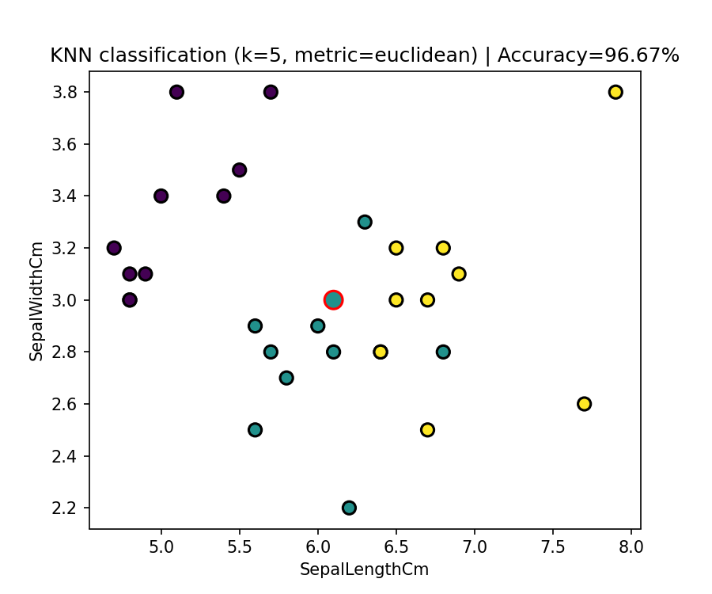

# programming
Código para classificação KNN para n dimensões e k neighbors

A implementação do código aceita métricas de distância Euclideana e Manhattan

Permite normalização através de Min_Max scaler ou Standardização através do Z-score

O exemplo.py utiliza o Dataset Iris do Scikit-learn e gera um ficheiro .png como output, onde as previsões erradas têm contorno vermelho e tamanho maior.

Não foi implementado cross-validation ou outras técnicas de ML por considerarmos não se enquadrarem no âmbito do projeto

Obrigado Ivo pela partilha de conhecimento,

Luis Paradinha
José Sousa

18/01/2026

